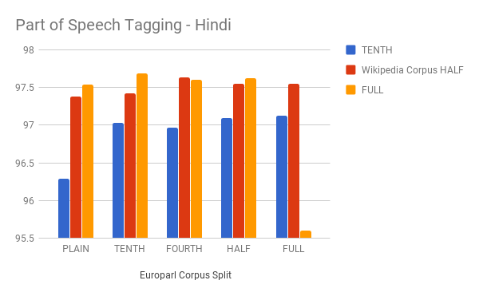
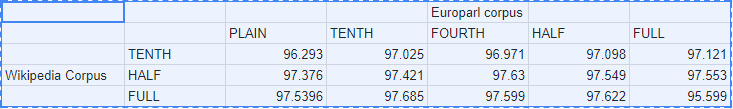

# Weekly-Status-Update
This page will temporary reflect weekly updates on the project

## Week 17 

* Part of Speech Tagging in Hindi - Completed task for embeddings from Wikipedia corpus vs a Combination of Wikipedia and Europarl Corpus

## Week 16

SUMMARY / GENERAL DIRECTION - 
1. Have tried the tasks with varying fractions of data (fractions from 0.01 to 1). 
2. Adding translated data does not incrementally improve performance on all of these tasks. 
3. Further direction - Use much larger fraction of translated data to train - Upto hundred times the available natural data from our current range of 2 or 3 times the natural text.

WEEKLY PROGRESS
* Obtained reuters corpus. Ran named entity recognition task for English. 
* Concluded all five tasks (for a total of thirty sets of embeddings) - NER, Chunking, Inference, Sentiment Analysis and Question Classification for English - Graphs for all of these tasks [here](https://docs.google.com/document/d/1IZBiPvSNaviKwNrjb0RC27ihw3E055TEL5AJsCWCZtg/edit). Link to [spreadsheet](https://docs.google.com/spreadsheets/d/1s-p7e6cP2jhqsXCM4C4R7Pem1HYurEPMiCoQjEbSNqg/edit#gid=0)
[Report](https://github.com/cibi29/Weekly-Status-Update/blob/master/NAACL_HLT_2016%20(2)%20(2).pdf)
* From the results obtained, all the tasks do not reinforce our claim that more training data means better embeddings. 
* Have requested Named Entity Recognition dataset used for the Indian Language NER contest in ICON 2013. Contacted members in NLP lab to regarding their own NER resources. 
* For this week - will be working on Part of Speech Tagging on Hindi first followed by NER. 

## Week 15 
* Worked on Natural Language Inference task using the Paraphrase Database 
* The task involves determining whether a natural language hypothesis h can reasonably be inferred from a natural language premise p.
Example : 
 1. p Several airlines polled saw costs grow more than expected, even after adjusting for inflation.
 2. h Some of the companies in the poll reported cost increases.
* The results for embeddings trained on "common vocabulary" of different data splits can be found [here](https://docs.google.com/document/d/1UNz7GPbtnuw1BUMPcwdGzwkJ_FyMlhcUiUnXM84CEB0/edit)
* Performance for the various embeddings used is very similar and does not prove that adding more training data improves accuracy in the task. The experiments were also performed selectively without using a commmon vocabulary. 
* Have obtained Hindi treebank from NLP lab, Currently in need of Conll 2003 dataset for English NER - paperwork required.
  

## Week 14
* As discussed last week, extrinsic tasks were performed in english to see if the results can be verified. 
* Comparison between embeddings trained on wikipedia dump and german to english translated corpora on three tasks - 
     1. Question Classification 
     2. Chunking
     3. Sentiment Analysis 
* So far, accuracies for both embeddings are quite similar despite the use of translated data in one. In case of sentiment analysis, performance seems to be better without augmented data. [Spreadsheet](https://docs.google.com/spreadsheets/d/1YGONjsOB_f-kuzWRAzNH86xrIGGohzAEV_WWmTJ_DXQ/edit#gid=0)
* These experiments were performed for fasttext embeddings. The same tests shall be performed on word2vec to see if the results hold. 

## Week 13 
* Completed tests with another extrinsic task - Question Classification. Please refer to the results [here](https://docs.google.com/spreadsheets/d/1YGONjsOB_f-kuzWRAzNH86xrIGGohzAEV_WWmTJ_DXQ/edit#gid=0)
* Results show that word2vec trained on the same data performs better than fasttext. However, in this test, our embeddings do not beat facebook's pretrained embeddings
* Started writing the paper - Link and details have been sent in the mail
* Read the following paper - "Enriching Word Vectors with Subword Information" 
	

## Week 12
* Obtained processed Hindi wikipedia corpora, generated word embeddings and obtained the following results on Sentiment Analysis - 
1. fastText on Hindi wikipedia and translated europarl - 77.33 percent 
2. Pretrained fastText embeddings (on wikipedia alone) - 74.04 percent
3. word2vec on Hindi wikipedia and translated europarl - 72.16 percent
* Working on the code for other extrinsic tasks (POS tagging, NER) as mentioned in the Veceval paper (there is a need for annotated data), spoke to Soumith from NLP lab and have requested for annotated corpora in nine indian languages. 
* Completed translation for five out of eight languages for these tasks. Generated Malayalam and Kannada translations this week. 
* One concern to be addressed in the paper - What do we mention about the machine translation system that was used ? 

## Week 11
* Generated word embeddings using fastText as opposed to word2vec. Training corpus used was the same europarl corpus used for word2vec. 
* Used the generated fastText embeddings in the sentiment analysis task and obtained an accuracy of 76.82 percent which compares with previous results as follows - 
1. fastText trained on europarl - 76.82 percent
2. fastText pretrained on wikipedia - 76.34 percent
3. word2vec trained on europarl - 74.97 percent
* Currently working on obtaining the Hindi wikipedia dump and preprocessing it so as to have more training data.
* Completed translation for yet another language. (Hindi, Telugu and Tamil are complete so far)
* Back-translation from "Improving Neural Machine Translation Models with Monolingual Data" - Rico Sennrich , ACL 2016
	

## Week 10
* Found a contradiction to last week’s results and hence reran sentiment analysis task for fasttext and hindi embeddings 
* Tests rerun again have shown the following to be the final results 
1. Fasttext embeddings - 76.34 percent
2. Word2vec embeddings from translated corpus - 74.97 percent 
* For embeddings trained on different fractions of the translated training data, accuracies range from 68.7 percent to       71.9 percent. While performance is almost directly related to fraction of trained data, there are some outliers which will have to be looked into. 
* Moved onto a different language (Tamil) to verify these results - Translation of the entire europarl corpus for creating embeddings as well as translation of imdb dataset for sentiment analysis is complete now.
* Processing the recreated parallel corpus (sentence-wise for the MT).

## Week 9
* Regenerating parallel corpus for English - Hindi for the MT. Previous output was in paragraphs and parallel sentences could not be obtained easily.  
* Reading the following paper - Word Translation Without Parallel Data - Alexis Conneau 
* Final Results on Sentiment Analysis Task - 
		Word Embeddings from translated data - 71.6 percent accuracy 
    Fasttext Word Embeddings - 55.79 percent accuracy 	
* For the sentiment analysis task, translated embeddings seem to perform better than fasttext embeddings. As mentioned in multiple papers however, some embeddings are better suited for certain tasks. Word2vec captures semantics better than fasttext, hence this result. This does not necessarily mean that these translated embeddings are altogether better than fasttext. More tasks should help us get a better evaluation.

## Week 8
* Evaluating Hindi - embeddings using Sentiment Analysis Task on IMDB reviews dataset containing 50000 balanced reviews . 
* On Original English dataset - reported accuracy is 87 % and state of the art is 88.89 percent. 
* On Hindi dataset obtained by translating these IMDB reviews and using word embeddings generated from a large europarl translated corpus- we get accuracies of around 51 percent. Haven’t yet identified the reason for this poor result. On the English dataset however, 86.2 percent accuracy is observed. 
* Trying to initialize the model using fasttext embeddings - have faced some difficulty due to unfamiliarity with the keras environment.
* Read a paper on Evaluating Word Embeddings Using a Representative Suite of Practical Tasks - [Paper](https://cs.stanford.edu/~angeli/papers/2016-acl-veceval.pdf) - therefore chose sentiment analysis task

## Week 7
* As suggested last week, I have been translating a larger english corpus to Hindi
* Regarding multilingual word embeddings and their evaluation, found a few papers that suggest similar or better approaches to tackle the problem in the following papers - 
1. Improving Vector Space Word Representations Using Mutlilingual Correlation - Manaal Faruqui and Chris Dyer EACL 2014
2. Massively Mutlilingual Word Embeddings - Waleed Ammar, Chris Dyer ... arXiv 2016
Both basically represent words from different languages in the same space and they seem to be a good direction to head in for the following reasons - 
* Two methods multiCluster and multiCCA only require monolingual corpora together with dictionaries between two or more languages thereby avoiding the need for parallel corpora or translated data. 
* Evaluation becomes easier without the need to create expensive language dependent tasks each time. Some methods still require annotated linguistic resources though.  

## Week 6
* Translated News Commentary 11 English corpus to Hindi sentences and plotted a graph of the vocabulary size for the source English corpus vs Translated Hindi sentences - [Graph](https://github.com/cibi29/Weekly-Status-Update/commit/9be4ff9125e2286a7ffca7667ff79d7ff5b42ae9)
1. The graph does show that the vocabulary size of Hindi does not increase as fast as that for the source english corpus. While this difference in vocabulary size keeps on increasing, the rate at which it does so is bound to decrease eventually as the vocabulary for any language saturates after a point. 
* German to English Translation on Europarl corpus and Word2vec run on it - [Spreadsheet](https://docs.google.com/spreadsheets/d/1M5-BnB-KgTU_q1Ld6e8_NayMAwLYuaveREOSlJKF7g0/edit?usp=sharing) 
1. The Europarl corpus contains proceedings of the European parliament. Results compare well with previous results that were obtained on the Patent Corpus and are more or less similar.  
* Continuing with the nlp and probability courses.  

## Week 5
* Evaluated the word embeddings using intrinsic tasks based on paper 3 listed below - [Spreadsheet](https://docs.google.com/spreadsheets/d/1M5-BnB-KgTU_q1Ld6e8_NayMAwLYuaveREOSlJKF7g0/edit?usp=sharing)
* Embeddings produced from machine translated training data as well as raw training data achieve the same scores on the various tasks thus suggesting that translated data can be used where raw training data is sparse. 
* As observed earlier, performance on all these tasks improves with increasing vocabulary size. This is because a larger vocabulary would mean more constrained word embeddings. The position of each word in the multi-dimensional graph gets more certain as the the vocabulary size (similar to the number of constraints) increases.

* Read the following papers related to Evaluation of Word Embeddings
1. Evaluation methods for unsupervised word embeddings - [Paper](http://www.aclweb.org/anthology/D15-1036)
2. Community Evaluation and Exchange of Word Vectors - [Paper](http://www.manaalfaruqui.com/papers/acl14-vecdemo.pdf)
3. Intrinsic Evaluation of Word Vectors Fails to Predict Extrinsic Performance - [Paper](https://www.aclweb.org/anthology/W/W16/W16-2501.pdf)

## Week 4
* Generated more translated german data and ran word2vec on them - Training data is approximately doubled from last week. 
1. Accuracy improves by only 2 percent. Final Accuracy : 17.3 percent
2. Training document size : 15101507 words.  Vocabulary Size : 24174
3. Accuracy observably improves with number of words in the vocabulary but the size of training data however contributes very little to increase in performance. 
4. Training Data, Vocab Size vs Accuracy - [Spreadsheet](https://docs.google.com/spreadsheets/d/1M5-BnB-KgTU_q1Ld6e8_NayMAwLYuaveREOSlJKF7g0/edit?usp=sharing) 
* Started two courses - one on NLP and another on Probability Theory  

## Week 3
* Ran a pretrained German to English OpenNMT model. This does not seem viable for the following reasons - 
1. Many of the words encountered at test time are marked as unknown as they haven't been encountered during training time.[Sample Output](https://github.com/cibi29/Weekly-Status-Update/blob/master/results.txt)
2. Translations take approximately 40 minutes for every 750 sentences - (approximately 7000 words). 
3. Training the model again would require huge resources as well as time. 
* Therefore queried Google Translate with German Corpus of Patent Information and obtained the following results - 
1. Word2vec results on part and whole of currently translated data. Results seem to favourably show that word2vec accuracy improves with more machine translated training data. - [Graph](https://github.com/cibi29/Weekly-Status-Update/blob/master/g_translate_results.png)
2. Machine Translated Word2vec results vs original word2vec results. The results obtained are close to that of using half the enwik8 dataset. The vocabulary of machine translated training data is however lower - [Graph](https://github.com/cibi29/Weekly-Status-Update/blob/master/figure_1.png)

## Week 2 (In Progress)
* Goal - Machine Translation from French to English to augment English dataset
* Reading about - 
1. FastText - Results on its performance with respect to word2vec on benchmarks. [Link](https://rare-technologies.com/fasttext-and-gensim-word-embeddings/)
2. Convolutional Sequence to Sequence Learning (Neural Machine Translation at Facebook)
3. Google's Neural Machine Translation System
* Word embeddings trained on Wikipedia using FastText were released recently by Facebook
* FastText Word Embeddings for Arabic were trained on the Arabic wikipedia corpus - vocabulary size = 610978

## Week 1
* Read the Active Learning Survery by Burr Settles
* Read the following papers - 
1. [Efficient Estimation of Word Representations in Vector Space](https://arxiv.org/pdf/1301.3781.pdf)
2. [word2vec Parameter Learning Explained](https://arxiv.org/pdf/1411.2738v3.pdf)
3. [Training Connectionist Networks with Queries and Selective Sampling](https://papers.nips.cc/paper/261-training-connectionist-networks-with-queries-and-selective-sampling.pdf)
* Word2vec was evaluated for different sizes of training dataset from 0.1 to the entire dataset. [Results](https://user-images.githubusercontent.com/27007966/28961123-d26b81c4-791e-11e7-8313-b3e05f6be733.png)
* As expected, performance increases almost linearly with the size of the training dataset.
